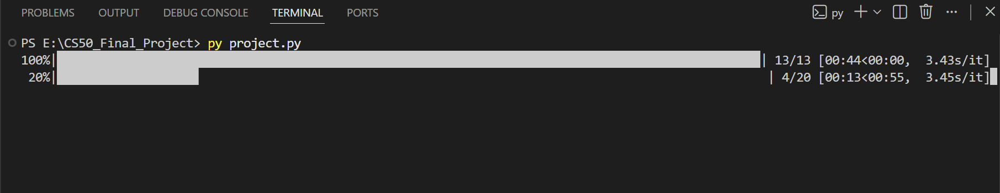
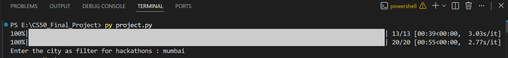
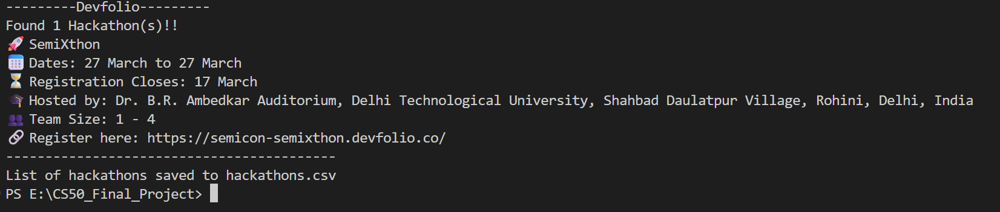

## Hackathon Tracker

### Video Demo:

[Link]

### Description:

This project gathers data about upcoming hackathons from **Unstop** and **Devfolio**. It is built on the principles of ethical web scraping. By using the Python `requests` library, the program interacts with public API endpoints to gather hackathon data in **JSON** (JavaScript Object Notation) format.

The core of the program lies in its ability to navigate complex, nested data structures. The `parse_json()` function extracts critical details such as the hackathon name, location, dates, and registration links. A primary focus of this tool is tracking the **registration deadline**, ensuring users never miss an opportunity due to timing.

---
### Installation & Usage:

1. Install the dependencies of `requirements.txt` using pip.
```Python
pip install -r requirements.txt
```

2. Run the project.py script
```Python
python project.py #For Linux/Mac
py project.py     #For Windows
```

3. Wait a few minutes for data extraction from the internet.
    
4. When prompted, enter the city name as a filter
    

5. The list of active hackathons in that city will be displayed.
    

---
### Libraries Used:

- `requests` - To send HTTP get requests and fetch data.
- `re` - For extracting `build_id` in the case of **Devfolio**.
- `tqdm` - To show a real-time progress bar on the terminal while the program is running, as scraping multiple pages of data can take a few minutes.
- `datetime` - To handle the ISO 8601 string format of time commonly used in JSON.
- `time` - To add a delay of a few seconds between the HTTP requests so that platform's servers don't crash.
- `csv` - To store the final extracted details in a simple tabular format.


### Key Functions:

- **`get_build_id() & extract_build_id()`** Since **Devfolio** utilizes a **Next.js** architecture, a unique `build_id` string is required to access their data endpoints. Because this string changes frequently with new deployments, these functions collectively are used to dynamically extract the current `build_id` from the site's HTML code by using **Regular Expressions (RegEx)** .
    
- **`calculate_pages()`** **Unstop** distributes its hackathon listings across multiple pages. This function queries the API to determine the `last_page` count, ensuring the scraper covers the entire database.
    
- **`get_data(build_id, total_pages)`** The main engine of the program. It iterates through the determined pages, sending requests and collecting raw JSON data into two primary lists: `unstop_json_list` and `devfolio_json_list`.
    
- **`parse_json()`** This function processes the complex  JSON data and organizes it into a clean **list of dictionaries**. Each  dictionary represents a hackathon and contains  keys: `name`, `start`, `link`, and `college`, making the data easy to manipulate.
    
- **`filter_hack_list()`** This function filters the aggregated lists based on a specific city (e.g., **Mumbai**) taken as an input from the user.
    
- **`display_save_hack_list()`** It formats the filtered data and displays it into a attractive, human-readable layout in the terminal using **f-strings** and visual separators for a clean user experience.It also saves this information in 'hackathons.csv' for future reference. 
  
### Ethical Considerations: 
This project prioritizes ethical data collection practices by adhering to the following guidelines:

- **Public Access Only:** This program only accesses public API endpoints provided by the platforms. It does not attempt to bypass login screens, authentication systems, or private user data.
    
- **Rate Limiting:** To ensure the target servers are not overwhelmed, the program implements a `time.sleep(2)` delay between requests. This "polite" scraping behavior ensures the script mimics human-like browsing speed rather than an aggressive bot.
    
- **User-Agent Identification:** All requests include a clear `User-Agent` header containing the project name and contact information. This ensures that the platform administrators can identify the source of the traffic and reach out if they have concerns.
